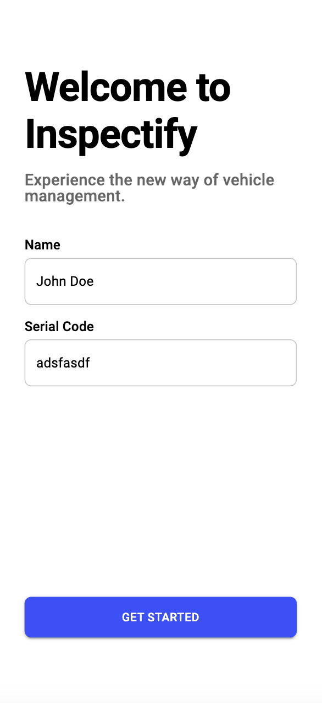

# HyundaiMobisHackathonWebApp

2023년 현대모비스 해커톤에서 개발한 웹앱입니다.

본 팀의 전체 활동 기록은 [여기](https://tidal-star-7e8.notion.site/1950db1c342b48d2b2c73cafc643ec16?pvs=4)를 참조하세요.

## Presentation

아래는 본 해커톤 중간 발표 영상으로, 프로젝트의 대략적인 내용을 파악하는데 도움이 됩니다.

[](https://www.youtube.com/watch?v=CbKnctSjMjM)

## 아이디어 기획안 전문

> [!NOTE]\
> 아이디어 기획안 본문은 [여기](https://docs.google.com/document/d/1Z-Hhk-sO52H874Xqhh9mCVpcY0QspD_g/edit?usp=sharing&ouid=104524476247909893342&rtpof=true&sd=true)를 참조하세요.

자율주행차의 상용화가 현실로 다가오면서, 관련한 정책 및 제도의 정비도 이에 맞추어 발빠르게 진행되고 있습니다. 이 중에서도 특히 보험제도의 경우, 정부에서 지난 12월부터 레벨 4~5단계 완전 자율주행차 보험제도 마련에 착수하였으며, 미래에는 완전 자율주행차의 사고 처리 과정에서 개인보다 제조사의 책임이 부각될 것입니다. 이에 본 팀은 가까운 미래에 현대모비스가 완전 자율주행차 간 사고 처리 과정에서 원인과 책임을 일관적인 방법으로 판단하고, 사고 상황의 데이터를 확보하여 자율주행 알고리즘의 결함을 보완할 수 있는 솔루션을 제안하고자 합니다.

일반적으로 일관적 ∙ 객관적 ∙ 정량적인 차량 상태 평가는 쉽지 않으며, 이로 인해 공업사와 보험사의 차량 피해 평가 및 과실 비율 산정에 대한 기준에 대한 의문이 소비자 입장에서 꾸준히 제기되어 왔습니다. 이와 같은 문제를 해소하고자 대부분의 차량은 블랙박스를 탑재하여 사고상황을 기록하도록 하고 있지만, 블랙박스는 미운행 상황에서 정확한 차량 손상 시점을 파악할 수 없으며, 운행 중 사고 상황에서도 차량의 피해 정도를 파악할 수 없다는 한계점이 존재합니다. 본 팀에서 제공하는 솔루션은 이러한 문제를 해결하기 위해 차량에 strain sensor를 부착하여 실시간으로 변형 정도를 파악하고, 자율주행차에 탑재된 카메라를 활용하여 사고 상황을 360도로 기록합니다. 또한 완전 자율주행차 간 사고는 알고리즘 결함이 주 원인이므로, 사고 당시 시스템 정보를 스냅샷으로 저장하여 디바이스에서의 차량 변형 시각화, 그리고 알고리즘 보완을 위한 메모리 스냅샷을 제공하는 통합 솔루션을 개발하는 것이 목적입니다.

## Showcase

로그인 화면 | 차량 상태 확인 화면 | 사고 상황 검색 화면
--- | --- | ---
 |  | 

## Getting Started

> [!WARNING]\
> This project is solely built as a prototype, and is not intended for production use.
> There are many unimplemented features that are nessesary for production use,
> and also the code is not optimized well in terms of program speed.
> Use it at your own risk if you want to use it in production.

```bash
npm i # Install dependencies

npx nx run emulators:run # Run the firebase emulator
npx nx run dummy-data:generate # Generate dummy data. More details in below.

npx nx run mobile-app:serve # Run the mobile app
```

## Tech Stack

- React
- MUI
- emotion
- Firebase

## Notes

### Display size

- iPhone 12 Pro. (390 x 844) 화면에 최적화 되어있습니다.
- [크롬 모바일 디바이스 모드](https://www.browserstack.com/guide/view-mobile-version-of-website-on-chrome)을 보면서 개발했습니다. iOS 시뮬레이터에서 앱바가 탈모에 걸리는지는 테스트를 안해봤다는 의미입니다.
- PWA 세팅이 되어있습니다. 모바일 환경에서는 홈 화면에 추가하면 앱처럼 사용할 수 있습니다. PWA 설치 방법은 [여기](https://www.cdc.gov/niosh/mining/content/hearingloss/installPWA.html)를 참조하세요.

### 너무 아쉽지만...

- [parts-graphical-view](https://github.com/junwha0511/parts-graphical-view) 포팅이 안되어서 일단 현대차 사진으로 채워놨습니다. 포팅은 시간 나면 하는데, 지금은 토플이 조금 급합니다.

### constants

- `libs/constants/src/index.ts`에 `PROJECT_NAME`과 `SPECIFIED_VEHICLE_SERIAL_CODE`라는 상수가 있습니다. 
- 전자는 바꾸면 실제 UI에 나타나는 이름이 바뀝니다. 변경사항을 적용하려면 `npx nx run constants:build`를 실행합니다.
- 후자는 그 값을 `serialCode`로 하는 더미데이터를 생성하는데 이용됩니다. 더미데이터 생성은 `npx nx run dummy-data:generate`로 할 수 있습니다.

### Admin Dashboard

- 어드민 대시보드는 사용하려는 프레임워크에 번들러 에러 (vite를 써서 그런 것으로 보임)가 있는데 해결하려면 꽤 많은 시간을 넣어야 할 것 같아서 관뒀습니다.
- 그 대신에 개발자들이나 데이터 사이언티스트들이 사용할 수 있도록 서버에서 데이터를 편리하게 읽어올 수 있는 JS/Python 클라이언트를 구현해두었습니다.
  - JS 클라이언트: `libs/firebase/src/client.ts` 에 `FirebaseClient`가 있습니다.
  - Python 클라이언트: `tools/client/client.py`에 `FirebaseClient`가 있습니다.
